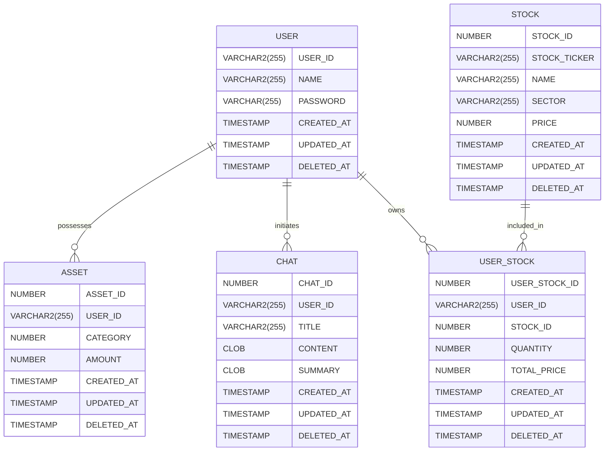

# 오늘 할 것들

- 에러 잡기 (가장 먼저)
    - [ ]  Enter키를 눌러 진행하세요 ui 바꾸기 (다같이)
    - [x]  자산 저장 시 ‘취소’ 안됨
        
        
        
        
    - [x]  매도 오류
        
        
        
    - [x]  선택창에서 취소도 만들기 (재진)
    - [x]  해당 종목 보유량 0일 때 메세지 출력됨 (지현)
        
        
        
    - [x]  보유량 0인 종목 처음 매수할 때 메세지 출력됨 (지현)
        
        
        
    - [x]  주식 매수할 때 평단가가 그대로 total_price로 들어감 (재진)
        
        
        
    - [x]  매도 기능 오류 (재진)
    - [x]  다 팔면 평단가 이상하게 출력
        - `db_getUserStockList` quantity >0 인 주식만 출력
        
        
        
    - [x]  txt 저장시
        
        
        
- 전체적인 용어, 말투 수정
    
    → 친절하게 
    
    - 다들 토스 배민 정독
    - 지피티 말투

- 선택 cmd 디자인

- ~~프로젝트 이름 정하기~~

- 문서작업
    - [요구사항 정의서](https://www.notion.so/1c7171107bce806cb18dd93ddc02e7c3?pvs=21)
    - [사용자 지침서](https://www.notion.so/1c7171107bce80e38b2cd0c35110d822?pvs=21)

- PPT 사진 수정

- ~~아스키 아트 찾기~~

최종.

